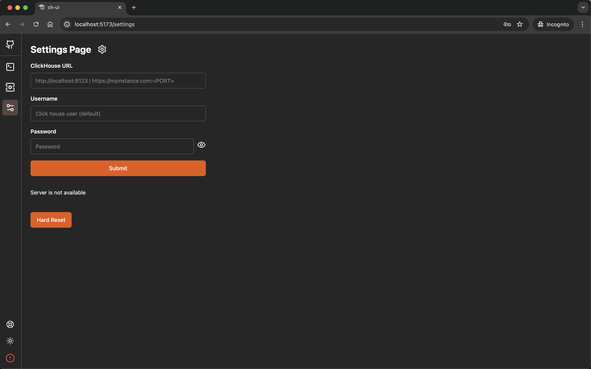
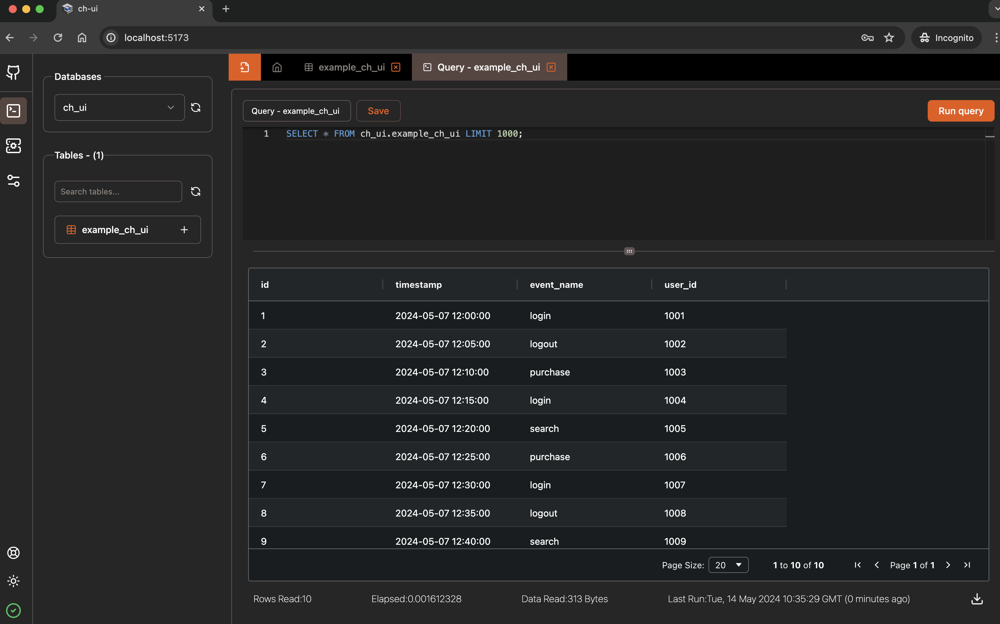
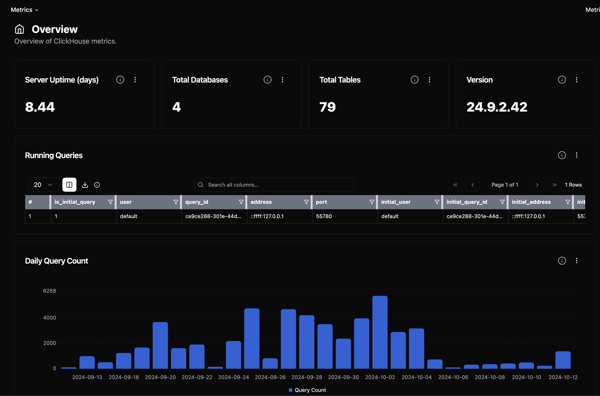

# CH - UI

This project aims to create a nice and updated UI for ClickHouse databases. It provides a modern interface for managing ClickHouse databases, executing queries, and visualizing data. The application is built with React and ClickHouse client for web.

## Features

- **ClickHouse Integration**: Interact with ClickHouse databases, manage connections, and execute queries.
- **Dynamic UI Components**: Utilize advanced UI components for data interaction.
- **Responsive Tab Management**: Create, manage, and dynamically interact with various tabs like query tabs and table tabs.
- **Performance Optimizations**: Efficient state management and optimized database interactions - Uses indexedDB for caching.

### Screenshots





## Getting Started

### Using npm and building from scratch

```bash
git https://github.com/caioricciuti/ch-ui.git
cd ch-ui
npm install
npm run build

** preview **
npm run preview

** debug **
npm run dev
```

### Using Docker

```bash
docker run -p 5521:5521 ghcr.io/caioricciuti/ch-ui:latest
```

### Using Environment Variables with Docker
CH-UI now supports setting ClickHouse connection details using environment variables when running with Docker. You can use the following variables:

VITE_CLICKHOUSE_URL: The URL of your ClickHouse server
VITE_CLICKHOUSE_USER: The username for ClickHouse authentication
VITE_CLICKHOUSE_PASS: The password for ClickHouse authentication

Example:
```
docker run -p 5521:5521 \
  -e VITE_CLICKHOUSE_URL=http://your-clickhouse-server:8123 \
  -e VITE_CLICKHOUSE_USER=your-username \
  -e VITE_CLICKHOUSE_PASS=your-password \
  ghcr.io/caioricciuti/ch-ui:latest
```

When these environment variables are set, CH-UI will automatically use them to configure the ClickHouse connection, bypassing the need for manual setup in the UI.

### Prerequisites

What things you need to install the software and how to install them:

```bash
nodejs >= 20.x
npm >= 10.x
```

## Security

This project is not intended for production use and should not be exposed to the public internet. It is recommended to run this application on a local machine or a secure network. The application does not provide any authentication or authorization mechanisms and does not encrypt data in transit or at rest. It is recommended to use a VPN or secure network to access ClickHouse databases.

## Limitations

I don't quite know what happens if there are more than 6 tabs open, since it caches on indexedDB (browser), all the times it will be limited by the browser's capacity. Also if something happens you can go manually to the indexedDB and delete the databases.

## Authors

Caio Ricciuti (caioricciuti) - hoping to get some help from the community! :)

## License

This project is licensed under the MIT License - see the LICENSE.md file for details

## Disclaimer

This project is a work in progress and is not yet ready for production use. It is intended for educational purposes and as a starting point for building a more robust application. My motivation for creating this project is to learn and experiment with ClickHouse databases and learn more about building web applications. I didn't find any modern UI for ClickHouse databases, so I decided to create one. It was made for me to use on my personal projects, so I didn't followed any design guidelines or best practices. Feel free to use it, modify it, and contribute to it. I'm open sourcing it in the hope that it will be useful to others, and I welcome any feedback or contributions. Keep in mind that this project is not affiliated with ClickHouse or Yandex or any other company, there is no official support or guarantee, and it is provided as-is (see the license for more details).

### Support

If you find this project useful, please consider supporting it by starring the repository, sharing it with others, or contributing to it. Your support is greatly appreciated! Also if you can and are willing to help me with the project, I would be very grateful, I develop this project in my spare time and I am not a software engineer. I'm a data engineer and I'm learning to develop web applications. I'm open to any suggestions, criticisms, and contributions. Thank you very much for your support! :D Some day hopefully I will be able to have more time to dedicate on this and other projects. Any financial support is also welcome, I have a buymeacoffee account, you can donate there, it will help me to keep this project alive. Thank you very much! :D

<a href="https://www.buymeacoffee.com/caioricciuti"></a>
