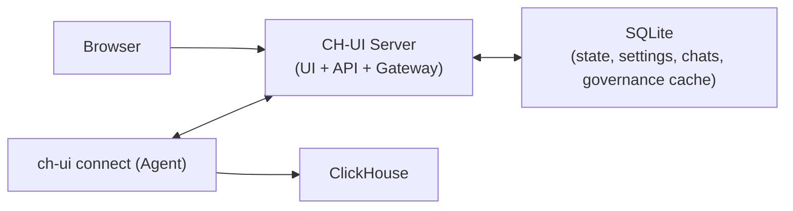

<p align="center">
  
</p>

<h1 align="center">CH-UI</h1>

<p align="center">
  ClickHouse workspace for teams that ship fast.<br/>
  Querying, governance, AI copilot, scheduling, and operations in one binary.
</p>

<p align="center">
  <a href="https://github.com/caioricciuti/ch-ui/releases"></a>
  <a href="https://github.com/caioricciuti/ch-ui/blob/main/LICENSE"></a>
  <a href="https://github.com/caioricciuti/ch-ui/stargazers"></a>
</p>

---

## Table Of Contents

- [What Is CH-UI?](#what-is-ch-ui)
- [Why Teams Use CH-UI](#why-teams-use-ch-ui)
- [Architecture](#architecture)
- [Feature Overview](#feature-overview)
- [Quick Start (Local)](#quick-start-local)
- [Quick Start (Docker)](#quick-start-docker)
- [Change Local ClickHouse URL](#change-local-clickhouse-url)
- [Can't Login?](#cant-login)
- [Remote ClickHouse (VM2 Server + VM1 Agent)](#remote-clickhouse-vm2-server--vm1-agent)
- [Tunnel Key Management (Server Host)](#tunnel-key-management-server-host)
- [CLI Reference](#cli-reference)
- [Configuration](#configuration)
- [Production Checklist](#production-checklist)
- [Governance, Brain, and Alerts](#governance-brain-and-alerts)
- [Troubleshooting](#troubleshooting)
- [Development](#development)
- [Upgrade](#upgrade)
- [Legal](#legal)
- [Contributing](#contributing)

---

## What Is CH-UI?

CH-UI is a self-hosted ClickHouse control plane that runs as a single executable.

It includes:
- A multi-tab SQL editor and explorer
- Dashboards and scheduled jobs
- Governance and access visibility
- Brain (AI assistant with chat history and artifacts)
- Admin workflows for users, providers, alerts, and operations

No Docker requirement. No extra backend services required to start.

---

## Why Teams Use CH-UI

- Fast setup: download binary, run, open browser
- Real operations: status, restart/stop, connector lifecycle, sync visibility
- Production flow: tunnel architecture for remote ClickHouse
- Governance value: lineage, incidents, policies, access matrix
- AI that is practical: model/provider control, persisted chats, SQL-aware artifacts

---

## Architecture

CH-UI supports two operating modes from the same binary:
- `server`: web app + API + tunnel gateway
- `connect`: lightweight agent that exposes local ClickHouse over secure WebSocket



For local development, the server starts an embedded connector automatically (localhost ClickHouse).

---

## Feature Overview

### Community (Apache 2.0)
- SQL editor + result views
- Database/table explorer
- Saved queries
- Local-first single-binary runtime

### Pro (license required)
- Dashboards and panel builder
- Schedules and execution history
- Brain (multi-chat, model/provider management, artifacts)
- Governance (metadata, access, incidents, policies, lineage)
- Admin panel and multi-connection operations
- Alerts (SMTP, Resend, Brevo) for policy/schedule/governance events

See: [`docs/license.md`](docs/license.md)

---

## Community vs Pro

| Capability | Community | Pro |
|---|:---:|:---:|
| SQL editor + explorer | Yes | Yes |
| Saved queries | Yes | Yes |
| Dashboards | - | Yes |
| Schedules | - | Yes |
| Brain (AI) | - | Yes |
| Governance + incidents + policies | - | Yes |
| Alerting channels/rules | - | Yes |
| Multi-connection admin workflows | - | Yes |

---

## Quick Start (Local)

### 1) Download

Linux (amd64):
```bash
curl -L -o ch-ui https://github.com/caioricciuti/ch-ui/releases/latest/download/ch-ui-linux-amd64
chmod +x ch-ui
```

Linux (arm64):
```bash
curl -L -o ch-ui https://github.com/caioricciuti/ch-ui/releases/latest/download/ch-ui-linux-arm64
chmod +x ch-ui
```

macOS (Apple Silicon):
```bash
curl -L -o ch-ui https://github.com/caioricciuti/ch-ui/releases/latest/download/ch-ui-darwin-arm64
chmod +x ch-ui
```

macOS (Intel):
```bash
curl -L -o ch-ui https://github.com/caioricciuti/ch-ui/releases/latest/download/ch-ui-darwin-amd64
chmod +x ch-ui
```

### Optional: verify checksum

```bash
curl -L -o checksums.txt https://github.com/caioricciuti/ch-ui/releases/latest/download/checksums.txt
sha256sum -c checksums.txt --ignore-missing
```

### 2) Start server

Install globally and run with `ch-ui`:

```bash
sudo install -m 755 ch-ui /usr/local/bin/ch-ui
ch-ui
```

If you prefer not to install globally, run `./ch-ui` from the download folder.

Default address: `http://localhost:3488`

### 3) Log in

Use a ClickHouse user/password for the selected connection.
For local setup, CH-UI uses the embedded connector against `http://localhost:8123` by default.

---

## Quick Start (Docker)

Run the official image:

```bash
docker run --rm \
  -p 3488:3488 \
  -v ch-ui-data:/app/data \
  -e CLICKHOUSE_URL=http://host.docker.internal:8123 \
  ghcr.io/caioricciuti/ch-ui:latest
```

Notes:
- On Linux, replace `host.docker.internal` with a host/IP reachable from the container.
- Persisted state is stored in `/app/data/ch-ui.db` (volume: `ch-ui-data`).

---

## Change Local ClickHouse URL

If `Local ClickHouse` points to the wrong endpoint, restart CH-UI with one of the options below:

CLI flag:
```bash
ch-ui server --clickhouse-url http://127.0.0.1:8123
```

Environment variable:
```bash
CLICKHOUSE_URL=http://127.0.0.1:8123 ch-ui server
```

Set a custom local connection name (optional):
```bash
ch-ui server --clickhouse-url http://127.0.0.1:8123 --connection-name "My Connection 1"
```

Environment variable equivalent:
```bash
CLICKHOUSE_URL=http://127.0.0.1:8123 CONNECTION_NAME="My Connection 1" ch-ui server
```

Config file (`server.yaml`):
```yaml
clickhouse_url: http://127.0.0.1:8123
connection_name: My Connection 1
```

Then start with:
```bash
ch-ui server -c /etc/ch-ui/server.yaml
```

Priority order for this setting:
- CLI flag (`--clickhouse-url`)
- Environment variable (`CLICKHOUSE_URL`)
- Config file (`server.yaml`)
- Built-in default (`http://localhost:8123`)

Connection display name priority:
- CLI flag (`--connection-name`)
- Environment variable (`CONNECTION_NAME`)
- Config file (`connection_name`)
- Built-in default (`Local ClickHouse`)

Tip: The login page includes a **Can't login?** action that opens a setup sheet (URL + connection name only; credentials stay in Sign in).
Changing this local URL does not require Admin access (Admin and multi-connection management are Pro-only).

---

## Can't login?

Use this path when login fails and you need fast recovery from the login screen.

1. In login, click **Can't login?**.
2. Set `ClickHouse URL` and `Connection Name`.
3. Restart CH-UI with one command:

```bash
ch-ui server --clickhouse-url 'http://127.0.0.1:8123' --connection-name 'My Connection 1'
```

Or local binary:

```bash
./ch-ui server --clickhouse-url 'http://127.0.0.1:8123' --connection-name 'My Connection 1'
```

Docker:

```bash
docker run --rm -p 3488:3488 -v ch-ui-data:/app/data \
  -e CLICKHOUSE_URL='http://127.0.0.1:8123' \
  -e CONNECTION_NAME='My Connection 1' \
  ghcr.io/caioricciuti/ch-ui:latest
```

Quick diagnosis:
- `Authentication failed`: wrong credentials for selected connection.
- `Connection unavailable` / `Unreachable`: wrong local URL or connector offline.
- `Too many login attempts`: wait retry window; if URL was wrong, fix setup and restart first.

Full guide: [`docs/cant-login.md`](docs/cant-login.md)

---

## Remote ClickHouse (VM2 Server + VM1 Agent)

This is the recommended production topology:
- VM2: `ch-ui server`
- VM1 (where ClickHouse runs): `ch-ui connect`

### VM2: start CH-UI server
```bash
ch-ui server --port 3488
```

### VM1: connect agent to VM2
```bash
ch-ui connect --url wss://your-ch-ui-domain/connect --key cht_your_tunnel_token
```

Notes:
- Token can be generated in UI or via `ch-ui tunnel create` on the server host.
- VM1 only needs outbound access to VM2 `/connect`.
- If a stale session exists, add `--takeover`.

For full hardening guide: [`docs/production-runbook.md`](docs/production-runbook.md)

---

## Tunnel Key Management (Server Host)

Run these on the CH-UI server host (VM where `ch-ui.db` lives):

```bash
# Create a connection + key
ch-ui tunnel create --name "vm1-clickhouse"

# List all tunnel connections
ch-ui tunnel list

# Show full token + setup commands for one connection
ch-ui tunnel show <connection-id>

# Rotate token (old token becomes invalid immediately)
ch-ui tunnel rotate <connection-id>

# Delete a tunnel connection
ch-ui tunnel delete <connection-id>
```

Useful flags:
- `--config, -c` use a specific server config file
- `--db` override SQLite path directly
- `--url` force public websocket URL used in generated setup commands

---

## CLI Reference

### If you are new, run these first

Local machine (fastest way):
```bash
ch-ui
```

Remote setup (VM2 server + VM1 ClickHouse):
```bash
# VM2
ch-ui server start --detach
ch-ui tunnel create --name "vm1-clickhouse" --url wss://your-domain/connect

# VM1
ch-ui connect --url wss://your-domain/connect --key cht_xxx --clickhouse-url http://127.0.0.1:8123
```

### Full command map

Top-level commands:
```bash
ch-ui
ch-ui server
ch-ui connect
ch-ui tunnel
ch-ui service
ch-ui update
ch-ui version
ch-ui completion
ch-ui help
```

### `server` (run CH-UI web app/API/gateway)

```bash
ch-ui server
ch-ui server start --detach
ch-ui server status
ch-ui server stop
ch-ui server restart
```

Common flags:
- `--port, -p` HTTP port (default `3488`)
- `--clickhouse-url` Local ClickHouse HTTP URL for embedded connection (default `http://localhost:8123`)
- `--connection-name` Display name for embedded local connection (default `Local ClickHouse`)
- `--config, -c` path to `server.yaml`
- `--detach` run in background
- `--pid-file` PID file location
- `--stop-timeout` graceful stop timeout
- `--dev` development mode (frontend proxy)

### `connect` (agent next to ClickHouse)

```bash
ch-ui connect --url wss://host/connect --key cht_xxx --clickhouse-url http://127.0.0.1:8123
ch-ui connect --detach
ch-ui connect --takeover
```

Common flags:
- `--url` WebSocket tunnel URL (`ws://` or `wss://`)
- `--key` tunnel token (`cht_...`)
- `--clickhouse-url` ClickHouse HTTP endpoint
- `--config, -c` connector config file path
- `--detach` run in background
- `--takeover` replace currently connected agent for same token

### `tunnel` (create/manage keys on server host)

```bash
ch-ui tunnel create --name "vm1-clickhouse"
ch-ui tunnel list
ch-ui tunnel show <connection-id>
ch-ui tunnel rotate <connection-id>
ch-ui tunnel delete <connection-id>
```

Common flags:
- `--config, -c` path to `server.yaml`
- `--db` override SQLite database path
- `--url` public URL used when printing connect/service setup commands

### `service` (install connector as OS service)

```bash
ch-ui service install --key cht_xxx --url wss://host/connect --clickhouse-url http://127.0.0.1:8123
ch-ui service status
ch-ui service start
ch-ui service stop
ch-ui service restart
ch-ui service logs -f
ch-ui service uninstall
```

### Other commands

```bash
ch-ui uninstall         # best-effort local uninstall + manual cleanup commands
ch-ui update            # update binary to latest release
ch-ui version           # print version
ch-ui completion bash   # generate shell completion
ch-ui help              # show help
```

---

## Configuration

Good news: CH-UI works without config files.

You only need config files when:
- you want production defaults
- you want service-managed startup
- you want to avoid passing flags every time

### Where config files live

- Server config (`server.yaml`)
- macOS: `~/.config/ch-ui/server.yaml`
- Linux: `/etc/ch-ui/server.yaml`

- Connector config (`config.yaml`)
- macOS: `~/.config/ch-ui/config.yaml`
- Linux: `/etc/ch-ui/config.yaml`

### How values are chosen (priority)

Server:
- CLI flags > environment variables > `server.yaml` > built-in defaults

Connector:
- CLI flags > environment variables > `config.yaml` > built-in defaults

### Server config (`server.yaml`) explained

```yaml
port: 3488
app_url: https://ch-ui.yourcompany.com
database_path: /var/lib/ch-ui/ch-ui.db
clickhouse_url: http://localhost:8123
connection_name: Local ClickHouse
app_secret_key: "change-this-in-production"
allowed_origins:
  - https://ch-ui.yourcompany.com
# optional override:
# tunnel_url: wss://ch-ui.yourcompany.com/connect
```

What each key means:

| Key | Example | Default | Why it matters |
|---|---|---|---|
| `port` | `3488` | `3488` | HTTP port used by CH-UI server |
| `app_url` | `https://ch-ui.example.com` | `http://localhost:<port>` | Public URL for links and tunnel URL inference |
| `database_path` | `/var/lib/ch-ui/ch-ui.db` | `./data/ch-ui.db` | Where CH-UI stores app state |
| `clickhouse_url` | `http://localhost:8123` | `http://localhost:8123` | Embedded local connection target |
| `connection_name` | `My Connection 1` | `Local ClickHouse` | Display name shown in login/session for embedded local connection |
| `app_secret_key` | random long string | built-in dev value | Encrypts session credentials; must change in production |
| `allowed_origins` | `["https://ch-ui.example.com"]` | empty | CORS allowlist |
| `tunnel_url` | `wss://ch-ui.example.com/connect` | derived from port | Explicit tunnel endpoint advertised to agents |

Server environment variables:
- `PORT`
- `APP_URL`
- `DATABASE_PATH`
- `CLICKHOUSE_URL`
- `CONNECTION_NAME`
- `APP_SECRET_KEY`
- `ALLOWED_ORIGINS` (comma-separated)
- `TUNNEL_URL`

### Connector config (`config.yaml`) explained

```yaml
tunnel_token: "cht_your_token"
clickhouse_url: "http://127.0.0.1:8123"
tunnel_url: "wss://your-ch-ui-domain/connect"
# insecure_skip_verify: false
```

What each key means:

| Key | Example | Default | Why it matters |
|---|---|---|---|
| `tunnel_token` | `cht_...` | none (required) | Auth key created on server (`ch-ui tunnel create`) |
| `clickhouse_url` | `http://127.0.0.1:8123` | `http://localhost:8123` | Local ClickHouse for this VM |
| `tunnel_url` | `wss://ch-ui.example.com/connect` | `wss://cloud.ch-ui.com/connect` | Server gateway endpoint |
| `insecure_skip_verify` | `false` | `false` | Only for insecure dev TLS setups |

Connector environment variables:
- `TUNNEL_TOKEN`
- `CLICKHOUSE_URL`
- `TUNNEL_URL`
- `TUNNEL_INSECURE_SKIP_VERIFY`

### Minimal production templates (copy/paste)

Server (`/etc/ch-ui/server.yaml`):
```yaml
port: 3488
app_url: https://ch-ui.example.com
database_path: /var/lib/ch-ui/ch-ui.db
app_secret_key: "replace-with-a-long-random-secret"
allowed_origins:
  - https://ch-ui.example.com
```

Connector (`/etc/ch-ui/config.yaml`):
```yaml
tunnel_token: "cht_replace_me"
clickhouse_url: "http://127.0.0.1:8123"
tunnel_url: "wss://ch-ui.example.com/connect"
```

---

## Production Checklist

- Set a strong `APP_SECRET_KEY`
- Set `APP_URL` to your public HTTPS URL
- Configure `ALLOWED_ORIGINS`
- Put CH-UI behind TLS reverse proxy
- Ensure WebSocket upgrade support for `/connect`
- Back up SQLite database (`database_path`)
- Run connector as service on remote hosts

Nginx example is included: [`ch-ui-cloud.conf`](ch-ui-cloud.conf)

### Backup and restore

CH-UI state is stored in SQLite (`database_path`), so backup is simple:

```bash
cp /var/lib/ch-ui/ch-ui.db /var/backups/ch-ui-$(date +%F).db
```

Restore by replacing the DB file while server is stopped.

---

## Governance, Brain, and Alerts

### Governance
- Metadata sync (databases/tables/columns)
- Query log + lineage ingestion
- Access sync (users/roles/grants/matrix)
- Policies and incidents workflow

### Brain
- Multiple chats per user/connection
- Provider layer (OpenAI, OpenAI-compatible, Ollama)
- Admin-controlled provider/model activation and defaults
- Artifacts persisted in database

### Alerts
- Channel providers: SMTP, Resend, Brevo
- Rules by event type/severity
- Route-level delivery and escalation options

---

## Troubleshooting

### `listen tcp :3488: bind: address already in use`
Another process is already using the port.

Check:
```bash
ch-ui server status
```
Then stop old process:
```bash
ch-ui server stop
```

If status says PID file is missing but port is in use, you likely upgraded from an older binary without PID management. Stop the old process once, then restart with current build.

### Connector keeps failing auth (`invalid token`)
- Verify you copied the latest `cht_...` token
- Check active connections with `ch-ui tunnel list`
- Regenerate with `ch-ui tunnel rotate <connection-id>` (or create a new one with `ch-ui tunnel create --name ...`)
- Confirm agent uses correct `--url` and token pair

### Login fails but no clarity
CH-UI now surfaces explicit login states (invalid credentials, offline connection, retry window). Verify selected connection is online.

### Local ClickHouse unreachable at login
If the `Local ClickHouse` connection is listed but unreachable:
- Use login **Can't login?** to open setup guidance and generate a startup command
- Restart CH-UI with `--clickhouse-url` or `CLICKHOUSE_URL`
- Reload login and retry with your ClickHouse credentials

### WebSocket/tunnel fails behind proxy
Your proxy must forward upgrades on `/connect`:
- `Upgrade` and `Connection: upgrade` headers
- long read/send timeouts
- buffering disabled for tunnel path

### Health check
```bash
curl http://localhost:3488/health
```

---

## Development

Requirements:
- Go 1.24+
- Bun

```bash
git clone https://github.com/caioricciuti/ch-ui.git
cd ch-ui
make build
ch-ui
```

Dev mode:
```bash
make dev
# in another terminal
cd ui && bun install && bun run dev
```

Useful targets:
- `make build`
- `make build-frontend`
- `make build-go`
- `make test`
- `make vet`
- `make clean`

---

## Upgrade

```bash
ch-ui update
```

The updater downloads the latest release asset for your OS/arch, verifies checksum when available, and replaces the running binary on disk.

---

## Legal

- Core license: [`LICENSE`](LICENSE)
- CH-UI licensing details: [`docs/license.md`](docs/license.md)
- Terms: [`docs/legal/terms-of-service.md`](docs/legal/terms-of-service.md)
- Privacy: [`docs/legal/privacy-policy.md`](docs/legal/privacy-policy.md)

---

## Contributing

Issues and PRs are welcome.

If you are contributing features, include:
- reproduction steps
- expected behavior
- migration notes (if schema/API changed)
- screenshots for UI changes
