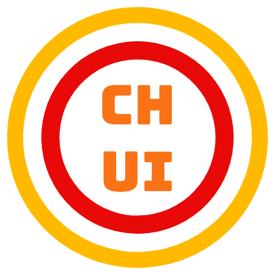
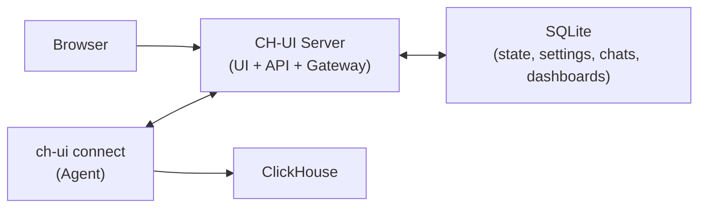

<p align="center">
  
</p>

<h1 align="center">CH-UI</h1>

<p align="center">
  <strong>The open-source ClickHouse management platform.</strong><br/>
  SQL editor, dashboards, AI copilot, data pipelines, models, and admin — all in one binary. Free.
</p>

<p align="center">
  <a href="https://github.com/caioricciuti/ch-ui/releases"></a>
  <a href="https://github.com/caioricciuti/ch-ui/blob/main/LICENSE"></a>
  <a href="https://github.com/caioricciuti/ch-ui/stargazers"></a>
  <a href="https://github.com/caioricciuti/ch-ui/pkgs/container/ch-ui"></a>
</p>

---

## Why CH-UI?

Most ClickHouse tools give you a query box and call it a day. CH-UI gives you a full workspace — and almost everything is **free and open source**.

Download one binary. Run it. Get:

- A multi-tab **SQL editor** with formatting, profiling, and streaming results
- **Dashboards** with a drag-and-drop panel builder and multiple chart types
- **Brain** — an AI assistant that understands your schema (OpenAI, Ollama, or any compatible provider)
- **Data pipelines** — visual builder for Webhook, S3, Kafka, and DB sources into ClickHouse
- **Models** — dbt-style SQL transformations with dependency graphs and scheduling
- **Admin panel** — user management, connection management, provider configuration
- **Saved queries**, **schema explorer**, **connection management**, and more

No Docker requirement. No external dependencies. No signup.

---

## Table of Contents

- [Features (Free)](#features-free)
- [Community vs Pro](#community-vs-pro)
- [Quick Start](#quick-start)
- [Quick Start (Docker)](#quick-start-docker)
- [Architecture](#architecture)
- [Remote ClickHouse (Tunnel)](#remote-clickhouse-tunnel)
- [CLI Reference](#cli-reference)
- [Configuration](#configuration)
- [Production Checklist](#production-checklist)
- [Troubleshooting](#troubleshooting)
- [Development](#development)
- [Upgrade](#upgrade)
- [Legal](#legal)
- [Contributing](#contributing)

---

## Features (Free)

Everything below is included in the free Community edition under Apache 2.0.

### SQL Editor

- Multi-tab interface with persistent state
- CodeMirror 6 with SQL syntax highlighting and autocomplete
- Query formatting and beautification
- Streaming results via SSE — no timeout on long queries
- **Query cost estimation** — see estimated rows and parts to scan before running (like BigQuery's dry run)
- Query profiling (pulls from `system.query_log`) with estimate vs actual accuracy comparison
- Query plan analysis (EXPLAIN with parsed tree view)
- Configurable max result rows and query timeout
- Guardrails enforcement (query validation before execution)

### Schema Explorer

- Full database/table/column tree browser
- Table data preview with pagination
- Column type introspection
- Search across databases and tables

### Dashboards

- Create unlimited dashboards
- Drag-and-drop panel builder
- Multiple chart types (line, bar, scatter, area, and more via uplot)
- Time range selector with presets (1h, 24h, 7d, 30d, custom)
- Timezone support
- Auto-refresh control
- Each panel runs its own SQL query against your ClickHouse

### Brain (AI Assistant)

- Chat with your data using natural language
- Multi-chat support with full history persistence
- **Provider support:** OpenAI, OpenAI-compatible APIs (Groq, Together, etc.), Ollama (local LLMs)
- Admin-controlled model and provider activation
- Schema-aware context (attach up to 10 tables as context per chat)
- SQL artifact generation — run generated queries directly from chat
- Brain skills (configurable system prompts/instructions)
- Token usage tracking
- Langfuse integration for LLM observability

### Data Pipelines

- Visual pipeline canvas (drag-and-drop with XyFlow)
- **Source connectors:** Webhook (inbound HTTP), Database (SQL query), S3, Kafka (with SCRAM auth)
- **Sink:** ClickHouse (native insert with configurable batch size)
- Pipeline start/stop controls
- Run history, metrics, and error tracking
- Real-time monitoring (rows ingested, bytes, batches, errors)

### Models (SQL Transformations)

- dbt-style SQL models with `table`, `view`, and `incremental` materialization
- Model dependency graph (DAG visualization)
- Execution with dependency ordering
- Run history and results tracking
- Table engine configuration per model
- Can be scheduled via the scheduler (Pro) or run manually

### Saved Queries

- Save queries with titles and descriptions
- Sort by date, name, or query length
- Filter, search, copy, and organize
- Quick access from the sidebar

### Admin Panel

- User management (create, delete, assign roles)
- ClickHouse user management (create users, update passwords, delete)
- Connection management with multi-connection support
- Brain provider and model configuration
- Brain skill management
- Langfuse integration settings
- System statistics dashboard

### Connections & Tunnel

- Multi-connection support (manage multiple ClickHouse instances)
- Secure WebSocket tunnel for remote ClickHouse access
- Token-based agent authentication
- Connection health monitoring
- Install connector as OS service (`ch-ui service install`)

### Other

- Dark mode
- Session-based authentication with rate limiting
- Security headers (CSP, X-Frame-Options, etc.)
- Health check endpoint (`/health`)
- Self-update (`ch-ui update`)
- Shell completion generation

---

## Community vs Pro

Almost everything is free. Pro adds enterprise governance and scheduling.

| Capability | Community (Free) | Pro |
|---|:---:|:---:|
| SQL editor + explorer + formatting + profiling | **Yes** | Yes |
| Saved queries | **Yes** | Yes |
| Dashboards + panel builder | **Yes** | Yes |
| Brain (AI assistant, multi-provider) | **Yes** | Yes |
| Data pipelines (Webhook, S3, Kafka, DB) | **Yes** | Yes |
| Models (SQL transformations, DAG) | **Yes** | Yes |
| Admin panel + user management | **Yes** | Yes |
| Multi-connection management | **Yes** | Yes |
| Tunnel (remote ClickHouse) | **Yes** | Yes |
| Scheduled query jobs + cron + history | - | **Yes** |
| Governance (metadata, visual lineage graph, column-level lineage, access matrix) | - | **Yes** |
| Policies + incidents + violations | - | **Yes** |
| Alerting (SMTP, Resend, Brevo) | - | **Yes** |

See: [`docs/license.md`](docs/license.md)

---

## Quick Start

### 1) Download

Linux (amd64):
```bash
curl -L -o ch-ui https://github.com/caioricciuti/ch-ui/releases/latest/download/ch-ui-linux-amd64
chmod +x ch-ui
```

Linux (arm64):
```bash
curl -L -o ch-ui https://github.com/caioricciuti/ch-ui/releases/latest/download/ch-ui-linux-arm64
chmod +x ch-ui
```

macOS (Apple Silicon):
```bash
curl -L -o ch-ui https://github.com/caioricciuti/ch-ui/releases/latest/download/ch-ui-darwin-arm64
chmod +x ch-ui
```

macOS (Intel):
```bash
curl -L -o ch-ui https://github.com/caioricciuti/ch-ui/releases/latest/download/ch-ui-darwin-amd64
chmod +x ch-ui
```

Optional — verify checksum:
```bash
curl -L -o checksums.txt https://github.com/caioricciuti/ch-ui/releases/latest/download/checksums.txt
sha256sum -c checksums.txt --ignore-missing
```

### 2) Run

```bash
sudo install -m 755 ch-ui /usr/local/bin/ch-ui
ch-ui
```

Or just `./ch-ui` from the download folder.

Open `http://localhost:3488` and log in with your ClickHouse credentials.

---

## Quick Start (Docker)

```bash
docker run --rm \
  -p 3488:3488 \
  -v ch-ui-data:/app/data \
  -e CLICKHOUSE_URL=http://host.docker.internal:8123 \
  ghcr.io/caioricciuti/ch-ui:latest
```

- On Linux, replace `host.docker.internal` with a host/IP reachable from the container.
- Persisted state is stored in `/app/data/ch-ui.db` (volume: `ch-ui-data`).

---

## Architecture

CH-UI ships as a single binary with two operating modes:
- **`server`** — web app + API + WebSocket tunnel gateway (default)
- **`connect`** — lightweight agent that exposes local ClickHouse over secure WebSocket


```mermaid
flowchart LR
    U["Browser"] --> S["CH-UI Server\n(UI + API + Gateway)"]
    S <--> DB["SQLite\n(state, settings, chats, dashboards)"]
    A["ch-ui connect\n(Agent)"] <--> S
    A --> CH["ClickHouse"]
```

For local use, the server starts an embedded connector automatically against `localhost:8123`.

**Tech stack:** Go backend (chi v5, SQLite WAL mode), Svelte 5 frontend (TypeScript, Vite, TailwindCSS), embedded at build time.

---

## Remote ClickHouse (Tunnel)

Connect to ClickHouse instances running on other machines using the secure WebSocket tunnel.

**Server (VM2):**
```bash
ch-ui server --port 3488
```

**Agent (VM1, where ClickHouse runs):**
```bash
ch-ui connect --url wss://your-ch-ui-domain/connect --key cht_your_tunnel_token
```

### Tunnel key management

Run these on the server host:

```bash
ch-ui tunnel create --name "vm1-clickhouse"   # Create connection + key
ch-ui tunnel list                              # List all connections
ch-ui tunnel show <connection-id>              # Show token + setup commands
ch-ui tunnel rotate <connection-id>            # Rotate token (old one invalidated)
ch-ui tunnel delete <connection-id>            # Delete connection
```

- Token can also be generated from the Admin UI.
- Agent only needs outbound access to the server's `/connect` endpoint.
- Add `--takeover` to replace a stale agent session.
- Install as OS service: `ch-ui service install --key cht_xxx --url wss://host/connect`

For full hardening guide: [`docs/production-runbook.md`](docs/production-runbook.md)

---

## CLI Reference

### Quick start commands

```bash
ch-ui                     # Start server (local ClickHouse)
ch-ui server start --detach  # Start in background
ch-ui server status          # Check if running
ch-ui server stop            # Stop server
```

### Full command map

| Command | Description |
|---|---|
| `ch-ui` / `ch-ui server` | Start web app + API + gateway |
| `ch-ui connect` | Start tunnel agent next to ClickHouse |
| `ch-ui tunnel create/list/show/rotate/delete` | Manage tunnel keys (server host) |
| `ch-ui service install/start/stop/status/logs/uninstall` | Manage connector as OS service |
| `ch-ui update` | Update to latest release |
| `ch-ui version` | Print version |
| `ch-ui completion bash/zsh/fish` | Generate shell completions |
| `ch-ui uninstall` | Remove CH-UI from system |

### Server flags

| Flag | Default | Description |
|---|---|---|
| `--port, -p` | `3488` | HTTP port |
| `--clickhouse-url` | `http://localhost:8123` | Local ClickHouse URL |
| `--connection-name` | `Local ClickHouse` | Display name for local connection |
| `--config, -c` | - | Path to `server.yaml` |
| `--detach` | - | Run in background |
| `--dev` | - | Development mode (proxy to Vite) |

### Connect flags

| Flag | Default | Description |
|---|---|---|
| `--url` | - | WebSocket tunnel URL (`wss://`) |
| `--key` | - | Tunnel token (`cht_...`) |
| `--clickhouse-url` | `http://localhost:8123` | Local ClickHouse |
| `--config, -c` | - | Path to `config.yaml` |
| `--detach` | - | Run in background |
| `--takeover` | - | Replace stale agent session |

---

## Configuration

CH-UI works without config files. You only need them for production defaults or service-managed startup.

### Config file locations

| File | macOS | Linux |
|---|---|---|
| `server.yaml` | `~/.config/ch-ui/server.yaml` | `/etc/ch-ui/server.yaml` |
| `config.yaml` | `~/.config/ch-ui/config.yaml` | `/etc/ch-ui/config.yaml` |

**Priority:** CLI flags > environment variables > config file > built-in defaults

### Server config

```yaml
port: 3488
app_url: https://ch-ui.yourcompany.com
database_path: /var/lib/ch-ui/ch-ui.db
clickhouse_url: http://localhost:8123
connection_name: Local ClickHouse
app_secret_key: "change-this-in-production"
allowed_origins:
  - https://ch-ui.yourcompany.com
```

| Key | Env var | Default | Description |
|---|---|---|---|
| `port` | `PORT` | `3488` | HTTP port |
| `app_url` | `APP_URL` | `http://localhost:<port>` | Public URL for links and tunnel inference |
| `database_path` | `DATABASE_PATH` | `./data/ch-ui.db` | SQLite database location |
| `clickhouse_url` | `CLICKHOUSE_URL` | `http://localhost:8123` | Embedded local connection target |
| `connection_name` | `CONNECTION_NAME` | `Local ClickHouse` | Display name for local connection |
| `app_secret_key` | `APP_SECRET_KEY` | auto-generated | Session encryption key |
| `allowed_origins` | `ALLOWED_ORIGINS` | empty | CORS allowlist (comma-separated in env) |
| `tunnel_url` | `TUNNEL_URL` | derived from port | Tunnel endpoint advertised to agents |

### Connector config

```yaml
tunnel_token: "cht_your_token"
clickhouse_url: "http://127.0.0.1:8123"
tunnel_url: "wss://your-ch-ui-domain/connect"
```

| Key | Env var | Default | Description |
|---|---|---|---|
| `tunnel_token` | `TUNNEL_TOKEN` | required | Auth key from `ch-ui tunnel create` |
| `clickhouse_url` | `CLICKHOUSE_URL` | `http://localhost:8123` | Local ClickHouse |
| `tunnel_url` | `TUNNEL_URL` | `ws://127.0.0.1:3488/connect` | Server gateway endpoint |

### Changing the local ClickHouse URL

```bash
# CLI flag
ch-ui server --clickhouse-url http://127.0.0.1:8123

# Environment variable
CLICKHOUSE_URL=http://127.0.0.1:8123 ch-ui server

# With custom connection name
ch-ui server --clickhouse-url http://127.0.0.1:8123 --connection-name "My ClickHouse"
```

The login page also has a **Can't login?** button that shows setup guidance.

---

## Production Checklist

- [ ] Set a strong `APP_SECRET_KEY`
- [ ] Set `APP_URL` to your public HTTPS URL
- [ ] Configure `ALLOWED_ORIGINS`
- [ ] Put CH-UI behind a TLS reverse proxy (Nginx example: [`ch-ui.conf`](ch-ui.conf))
- [ ] Ensure WebSocket upgrade support for `/connect`
- [ ] Back up SQLite database regularly
- [ ] Run connector as OS service on remote hosts

### Backup and restore

```bash
# Backup
cp /var/lib/ch-ui/ch-ui.db /var/backups/ch-ui-$(date +%F).db

# Restore — stop server first, then replace the DB file
```

---

## Troubleshooting

### Port already in use

```bash
ch-ui server status   # Check if already running
ch-ui server stop     # Stop the old process
```

### Can't log in

- **Authentication failed** — wrong ClickHouse credentials
- **Connection unavailable** — wrong URL or connector offline
- **Too many attempts** — wait for retry window; fix URL first if needed

Click **Can't login?** on the login page for guided recovery, or restart with:
```bash
ch-ui server --clickhouse-url 'http://127.0.0.1:8123'
```

Full guide: [`docs/cant-login.md`](docs/cant-login.md)

### Connector auth fails (`invalid token`)

- Verify you copied the latest `cht_...` token
- Check with `ch-ui tunnel list`
- Rotate with `ch-ui tunnel rotate <connection-id>`

### WebSocket fails behind proxy

Your proxy must forward upgrades on `/connect`:
- `Upgrade` and `Connection: upgrade` headers
- Long read/send timeouts
- Buffering disabled for tunnel path

### Health check

```bash
curl http://localhost:3488/health
```

---

## Development

Requirements: Go 1.25+, Bun

```bash
git clone https://github.com/caioricciuti/ch-ui.git
cd ch-ui
make build    # Full production build (frontend + Go binary)
./ch-ui
```

Dev mode (two terminals):
```bash
make dev                              # Terminal 1: Go server
cd ui && bun install && bun run dev   # Terminal 2: Vite dev server
```

Useful targets: `make build` | `make test` | `make vet` | `make clean` | `make rebuild`

---

## Upgrade

```bash
ch-ui update
```

Downloads the latest release for your OS/arch, verifies checksum, and replaces the binary.

---

## Legal

- Core license: [`LICENSE`](LICENSE) (Apache 2.0)
- Licensing details: [`docs/license.md`](docs/license.md)
- Terms: [`docs/legal/terms-of-service.md`](docs/legal/terms-of-service.md)
- Privacy: [`docs/legal/privacy-policy.md`](docs/legal/privacy-policy.md)

---

## Contributing

Issues and PRs are welcome.

When contributing, please include:
- Reproduction steps (for bugs)
- Expected behavior
- Migration notes (if schema/API changed)
- Screenshots (for UI changes)


# Gitpod One-Click Demo

## Try it now

[](https://gitpod.io/#https://github.com/caioricciuti/ch-ui)

> Launches a full CH-UI + ClickHouse environment in your browser. No install required.
> Free tier: 50 hours/month, no credit card - Via Gitpod (https://www.gitpod.io/)