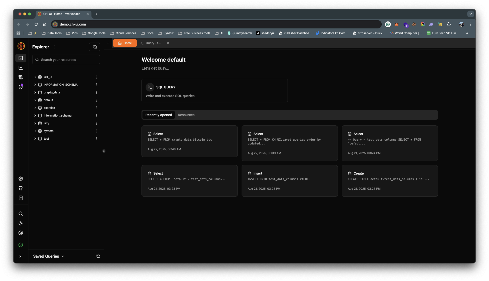
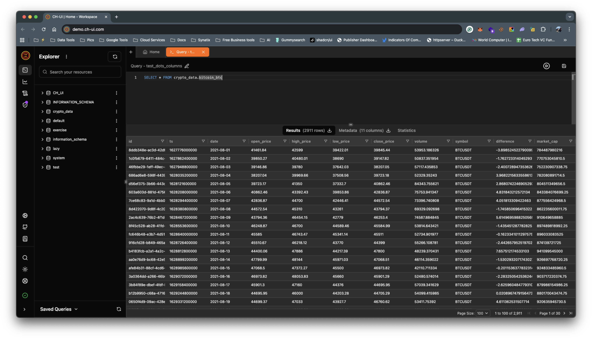

# CH-UI 🚀 - Enhanced Security Fork

[](https://github.com/caioricciuti/ch-ui/releases)

## 🔐 **Security-Enhanced Fork**

This is an enhanced fork of the original [CH-UI](https://github.com/caioricciuti/ch-ui) by Caio Ricciuti, featuring **secure runtime authentication** improvements.

### 🎯 **Fork Highlights**
- ✅ **Login Authentication** - Users must enter credentials instead of auto-connecting
- ✅ **Runtime Credential Entry** - No more hardcoded credentials in Docker configs
- ✅ **Session Management** - 8-hour session expiry with automatic logout
- ✅ **No Proxy Required** - Eliminates need for BasicAuth or reverse proxy protection
- ✅ **100% Backward Compatible** - Existing Docker deployments continue working unchanged

### 💡 **Why This Fork?**
The original CH-UI **auto-connects** using environment variables, which creates security concerns:
- 🚫 **Auto-login bypass**: Users are automatically logged in without entering credentials
- 🚫 **Exposed credentials**: Database credentials visible in Docker configurations
- 🚫 **Public repository risk**: Credentials stored in container orchestration configs
- 🚫 **No user authentication**: Anyone with URL access gets immediate database access
- 🚫 **Requires proxy protection**: Needs additional BasicAuth/reverse proxy for security

**This fork adds a proper login screen** where users must enter their ClickHouse server details and credentials before accessing the database, eliminating the need for environment variables and proxy authentication.

### 🖼️ **See the Security Enhancement**

Instead of auto-connecting with environment variables, users now see a secure login page:


*Professional login interface with ClickHouse server configuration and session management options*

### 🚀 **Quick Start with Enhanced Security**

**Option 1: Secure Login (Recommended)**
```bash
# Run without credentials - users see login page
docker run -p 5521:5521 your-dockerhub-username/ch-ui-secure:latest
# Navigate to http://localhost:5521 and use the login form
```

**Option 2: Traditional Docker (Backward Compatible)**
```bash
# Existing deployments continue working
docker run -p 5521:5521 \
  -e VITE_CLICKHOUSE_URL="http://clickhouse-server:8123" \
  -e VITE_CLICKHOUSE_USER="default" \
  -e VITE_CLICKHOUSE_PASS="password" \
  your-dockerhub-username/ch-ui-secure:latest
```

---

## 📖 **About CH-UI**

A modern, feature-rich web interface for ClickHouse databases. CH-UI provides an intuitive platform for managing ClickHouse databases, executing queries, and visualizing metrics about your instance.

## 🌟 Key Features

### Core Functionality
- **🔄 ClickHouse Integration**: Seamless connection and interaction with ClickHouse databases
- **📝 Advanced SQL Editor**: 
  - Intelligent IntelliSense with autocomplete suggestions
  - Syntax highlighting
  - Query history tracking
  - Multi-tab query execution
  - Query saving and management
- **📊 Dynamic Data Visualization**: 
  - Interactive data tables with sorting and filtering
  - Support for column names with special characters (dots, spaces, etc.)
  - Custom visualization options
  - Real-time data updates

### Performance & Architecture
- **⚡ Optimized Performance**:
- LocalStorage-based lightweight persistence
  - Efficient state management
  - Responsive UI even with large datasets
- **🔒 TypeScript Implementation**: Full TypeScript support for improved code quality and developer experience
- **📦 Custom Table Management**: Built-in table handling without third-party dependencies

### Monitoring & Analytics
- **📈 Enhanced Metrics Dashboard**:
  - Query performance monitoring
  - Table statistics and insights
  - System settings overview
  - Network performance metrics
  - Resource utilization tracking

### Advanced Features
- **🌐 Distributed ClickHouse Support**:
  - ON CLUSTER operations for tables and users
  - Cluster-aware table creation
  - Distributed engine support
- **🔀 Reverse Proxy/Subpath Support**:
  - Deploy behind nginx/apache with custom base paths
  - Flexible URL routing
  - Production-ready proxy configurations
- **🔧 Runtime Configuration**:
  - Environment variables injected at Docker runtime
  - No rebuild required for configuration changes
  - Flexible deployment options

### User Experience
- **🎨 Modern UI/UX**:
  - Clean, intuitive interface
  - Responsive design
  - Dark/Light mode support
  - Customizable layouts

## 📸 Screenshots

<div style="display: flex; justify-content: space-between; margin-bottom: 20px;">
  
  
  
  
</div>

## 🚀 Getting Started

### Option 1: Docker (Recommended)

#### Simple Start
```bash
docker run --name ch-ui -p 5521:5521 ghcr.io/caioricciuti/ch-ui:latest
```

#### Using Docker Compose
Create a `docker-compose.yml`:
```yaml
services:
  ch-ui:
    image: ghcr.io/caioricciuti/ch-ui:latest
    restart: always
    ports:
      - "5521:5521"
    environment:
      # Core ClickHouse Configuration
      VITE_CLICKHOUSE_URL: "http://your-clickhouse-server:8123"
      VITE_CLICKHOUSE_USER: "your-username"
      VITE_CLICKHOUSE_PASS: "your-password"
      
      # Optional: Advanced Features
      VITE_CLICKHOUSE_USE_ADVANCED: "false"
      VITE_CLICKHOUSE_CUSTOM_PATH: ""
      VITE_CLICKHOUSE_REQUEST_TIMEOUT: "30000"
      
      # Optional: Reverse Proxy Support
      VITE_BASE_PATH: "/"
```

Then run:
```bash
docker-compose up -d
```

#### Environment Variables

| Variable | Description | Required | Default | Since |
|----------|-------------|----------|---------|-------|
| **Core Configuration** |
| VITE_CLICKHOUSE_URL | ClickHouse server URL | Yes | - | v1.0.0 |
| VITE_CLICKHOUSE_USER | ClickHouse username | Yes | - | v1.0.0 |
| VITE_CLICKHOUSE_PASS | ClickHouse password | No | "" | v1.0.0 |
| **Advanced Features** |
| VITE_CLICKHOUSE_USE_ADVANCED | Enable advanced ClickHouse features (e.g., custom settings, system tables access) | No | false | v1.4.0 |
| VITE_CLICKHOUSE_CUSTOM_PATH | Custom path for ClickHouse HTTP interface | No | - | v1.4.0 |
| VITE_CLICKHOUSE_REQUEST_TIMEOUT | Request timeout in milliseconds | No | 30000 | v1.4.0 |
| **Deployment Configuration** |
| VITE_BASE_PATH | Base path for reverse proxy deployment (e.g., "/ch-ui") | No | "/" | v1.5.30 |

#### Advanced Docker Configuration

##### Complete Example with All Options
```yaml
services:
  ch-ui:
    image: ghcr.io/caioricciuti/ch-ui:latest
    restart: always
    ports:
      - "5521:5521"
    environment:
      # Core Configuration
      VITE_CLICKHOUSE_URL: "http://your-clickhouse-server:8123"
      VITE_CLICKHOUSE_USER: "your-username"
      VITE_CLICKHOUSE_PASS: "your-password"
      
      # Advanced Options
      VITE_CLICKHOUSE_USE_ADVANCED: "true"  # Enable advanced features
      VITE_CLICKHOUSE_CUSTOM_PATH: "/custom/path"  # Custom HTTP path
      VITE_CLICKHOUSE_REQUEST_TIMEOUT: "60000"  # 60 second timeout
      
      # Deployment Options
      VITE_BASE_PATH: "/ch-ui"  # Deploy at https://yourdomain.com/ch-ui
```

##### Docker Run with All Options
```bash
docker run --name ch-ui -p 5521:5521 \
  -e VITE_CLICKHOUSE_URL=http://your-clickhouse-server:8123 \
  -e VITE_CLICKHOUSE_USER=your-username \
  -e VITE_CLICKHOUSE_PASS=your-password \
  -e VITE_CLICKHOUSE_USE_ADVANCED=true \
  -e VITE_CLICKHOUSE_CUSTOM_PATH=/custom/path \
  -e VITE_CLICKHOUSE_REQUEST_TIMEOUT=60000 \
  -e VITE_BASE_PATH=/ch-ui \
  ghcr.io/caioricciuti/ch-ui:latest
```

### Option 2: Build from Source

#### Prerequisites
- Node.js >= 20.x
- npm >= 10.x

#### Installation Steps
```bash
# Clone the repository
git clone https://github.com/caioricciuti/ch-ui.git

# Navigate to project directory
cd ch-ui

# Install dependencies
npm install

# Build the project
npm run build

# Start for development
npm run dev

# Start for production
npm run preview
```

## 🧪 Development Environment

### Local ClickHouse Instance
For development purposes, you can run a local ClickHouse instance using Docker:

```bash
# Start ClickHouse
docker-compose -f docker-compose-dev.yml up -d

# Stop ClickHouse
docker-compose -f docker-compose-dev.yml down
```

Default credentials:
- URL: http://localhost:8123
- Username: dev
- Password: dev

Data is persisted in `.clickhouse_local_data` directory.

## 🔒 Security & Production Deployment

### Reverse Proxy Setup with Nginx

When deploying CH-UI behind a reverse proxy with a custom base path:

#### Nginx Configuration
```nginx
server {
    listen 80;
    server_name your-domain.com;

    # CH-UI with custom base path
    location /ch-ui/ {
        proxy_pass http://localhost:5521/;
        proxy_set_header Host $host;
        proxy_set_header X-Real-IP $remote_addr;
        proxy_set_header X-Forwarded-For $proxy_add_x_forwarded_for;
        proxy_set_header X-Forwarded-Proto $scheme;
        
        # WebSocket support for real-time features
        proxy_http_version 1.1;
        proxy_set_header Upgrade $http_upgrade;
        proxy_set_header Connection "upgrade";
    }
}
```

#### Docker Compose for Reverse Proxy
```yaml
services:
  ch-ui:
    image: ghcr.io/caioricciuti/ch-ui:latest
    restart: always
    ports:
      - "127.0.0.1:5521:5521"  # Only bind to localhost
    environment:
      VITE_CLICKHOUSE_URL: "http://your-clickhouse-server:8123"
      VITE_CLICKHOUSE_USER: "your-username"
      VITE_CLICKHOUSE_PASS: "your-password"
      VITE_BASE_PATH: "/ch-ui"  # Must match nginx location
```

### HTTPS with Let's Encrypt
```nginx
server {
    listen 443 ssl http2;
    server_name your-domain.com;

    ssl_certificate /etc/letsencrypt/live/your-domain.com/fullchain.pem;
    ssl_certificate_key /etc/letsencrypt/live/your-domain.com/privkey.pem;

    location /ch-ui/ {
        proxy_pass http://localhost:5521/;
        # ... rest of proxy configuration
    }
}
```

### Authentication with Basic Auth
```nginx
server {
    listen 80;
    server_name your-domain.com;

    location /ch-ui/ {
        auth_basic "Restricted Access";
        auth_basic_user_file /etc/nginx/.htpasswd;
        
        proxy_pass http://localhost:5521/;
        # ... rest of proxy configuration
    }
}
```

### Runtime Authentication (New Security Feature)

CH-UI now supports secure runtime authentication instead of storing credentials in environment variables. This provides enhanced security for production deployments.

#### Login Page Authentication
Instead of hardcoding credentials in environment variables, users can now:
- **Login Page**: Enter credentials securely through a dedicated login interface
- **Session Management**: Temporary 8-hour sessions for enhanced security
- **Optional Persistence**: Choose to remember credentials locally or use session-only authentication

#### Authentication Modes
1. **Environment Variables** (Docker mode): Credentials set via environment variables (auto-login)
2. **Session Authentication**: Temporary login with 8-hour session expiry
3. **Saved Credentials**: Persistent login with credentials stored locally

#### Security Benefits
- **No Environment Variable Exposure**: Credentials no longer stored in Docker configs or public repositories
- **Session Expiration**: Automatic logout after 8 hours for session-based authentication
- **Runtime Input**: Credentials entered securely at application runtime
- **Logout Functionality**: Manual logout available in Settings and Sidebar

#### Usage Examples

**Secure Session-based Login** (Recommended for shared environments):
```bash
# Run without credentials - users will see login page
docker run -p 5521:5521 ghcr.io/caioricciuti/ch-ui:latest
```

**Traditional Environment Variables** (Docker mode):
```bash
# Still supported for backwards compatibility
docker run -p 5521:5521 \
  -e VITE_CLICKHOUSE_URL="http://clickhouse-server:8123" \
  -e VITE_CLICKHOUSE_USER="default" \
  -e VITE_CLICKHOUSE_PASS="password" \
  ghcr.io/caioricciuti/ch-ui:latest
```

**Saved Credentials** (For personal use):
- Login through the web interface
- Check "Remember credentials" during login
- Credentials will persist between browser sessions

## 🎯 Distributed ClickHouse Support

CH-UI now supports distributed ClickHouse deployments with cluster operations:

### Features
- **ON CLUSTER Support**: Create tables and users across entire clusters
- **Cluster-Aware Operations**: Automatic detection of distributed setups
- **Distributed Engine**: Support for Distributed table engine

### Configuration
In your Settings page, enable "Distributed Mode" and specify your cluster name. This will:
- Enable ON CLUSTER syntax for table creation
- Enable ON CLUSTER syntax for user management
- Show cluster-specific options in the UI

### Example: Creating a Distributed Table
1. Enable Distributed Mode in Settings
2. Create a table with "ON CLUSTER" option checked
3. Select "Distributed" as the table engine
4. CH-UI will generate the appropriate DDL with cluster syntax

## 🐛 Troubleshooting

### Common Issues

#### Environment Variables Not Working
If environment variables aren't being applied:
1. Ensure you're using the latest image: `docker pull ghcr.io/caioricciuti/ch-ui:latest`
2. Check logs: `docker logs ch-ui`
3. Verify variables are set: The logs should show which variables are SET/NOT SET

#### Reverse Proxy Issues
If CH-UI doesn't work correctly behind a reverse proxy:
1. Ensure `VITE_BASE_PATH` matches your proxy location
2. Don't include trailing slashes in `VITE_BASE_PATH`
3. Check browser console for 404 errors on assets

#### Column Names with Special Characters
CH-UI now properly handles column names containing:
- Dots (e.g., `user.email`)
- Spaces (e.g., `User Name`)
- Special characters

No configuration needed - this works automatically.

## 📚 Documentation


For detailed documentation, visit our [official documentation](https://ch-ui.com/docs/getting-started?utm_source=ch-ui&utm_medium=gitHubReadme).

## 🔄 Migration Guide

### Upgrading from v1.4.x to v1.5.30

#### New Features
1. **Reverse Proxy Support**: Set `VITE_BASE_PATH` if deploying behind a proxy
2. **Distributed ClickHouse**: Enable in Settings for cluster operations
3. **Enhanced Column Rendering**: No changes needed, automatic improvement

#### Breaking Changes
None - v1.5.30 is fully backward compatible.

#### Recommended Actions
1. Pull the latest Docker image
2. Review new environment variables
3. Test distributed features if using ClickHouse clusters

## 🤝 Contributing

Contributions are welcome! Please feel free to submit a Pull Request.

### Development Setup
```bash
# Clone and install
git clone https://github.com/caioricciuti/ch-ui.git
cd ch-ui
npm install

# Run tests
npm test

# Run linter
npm run lint

# Start development server
npm run dev
```

## ❤️ Sponsors

<div align="center">
  <a href="https://iberodata.es/?utm_source=ch-ui&utm_medium=github" target="_blank">
    
  </a>
  
  <p><strong>Iberodata</strong> - Empowering businesses with data-driven solutions</p>
</div>

## ☕ Support the Project

If you find CH-UI helpful, consider supporting its development:

<div align="center">
  <a href="https://buymeacoffee.com/caioricciuti?utm_source=ch-ui&utm_medium=github">
    
  </a>
</div>

Your support helps maintain and improve CH-UI! ✨

## 📄 License

This project is licensed under the Apache License 2.0 - see the [LICENSE](./LICENSE.md) file for details.


Made with ❤️ by [Caio Ricciuti](https://github.com/caioricciuti)
